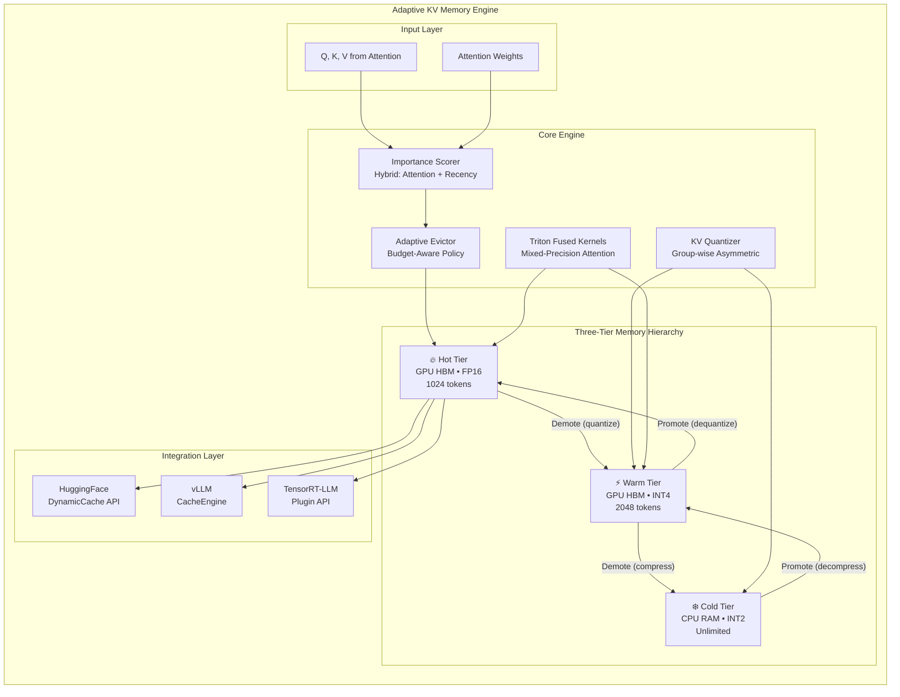
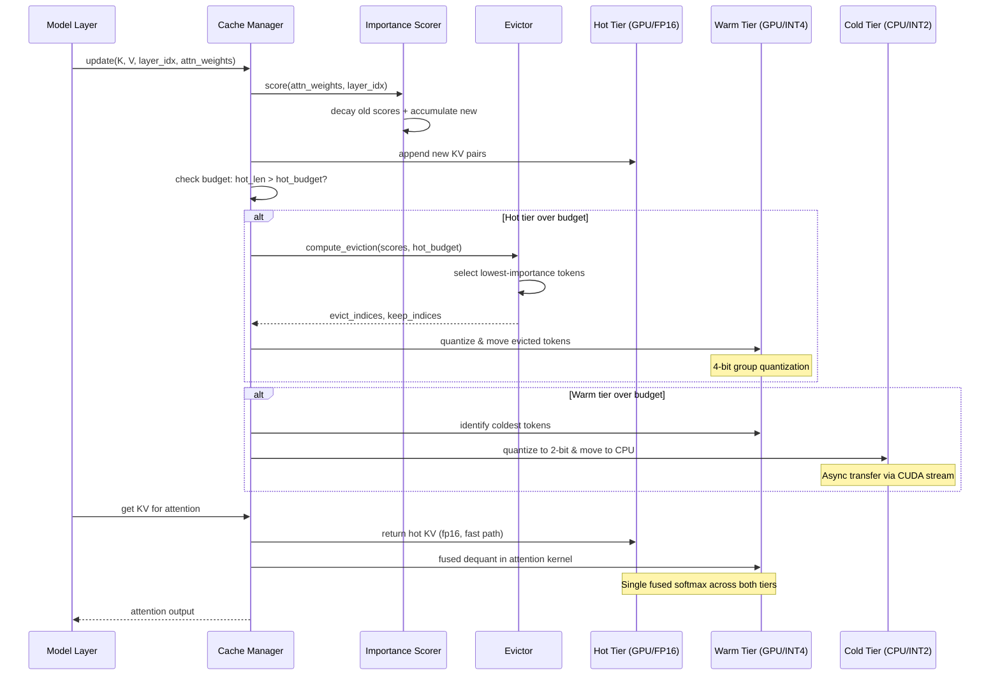
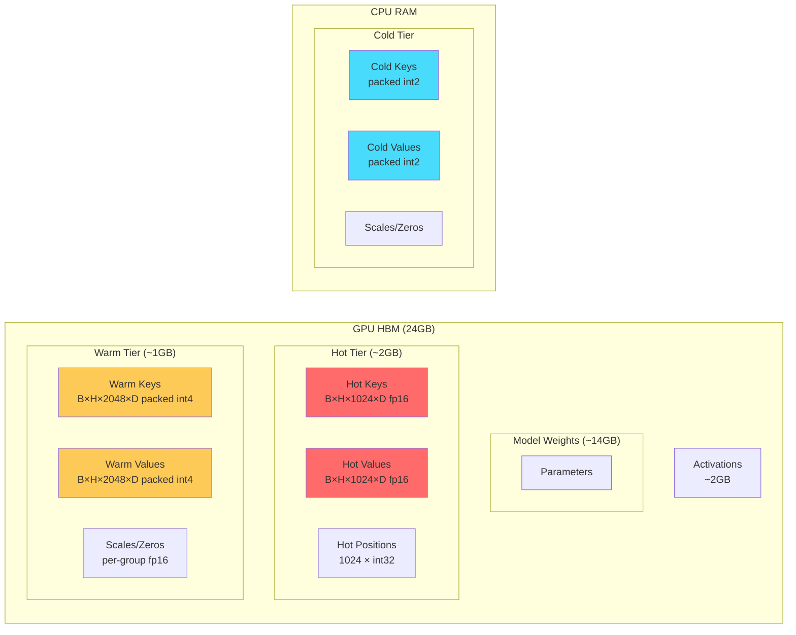
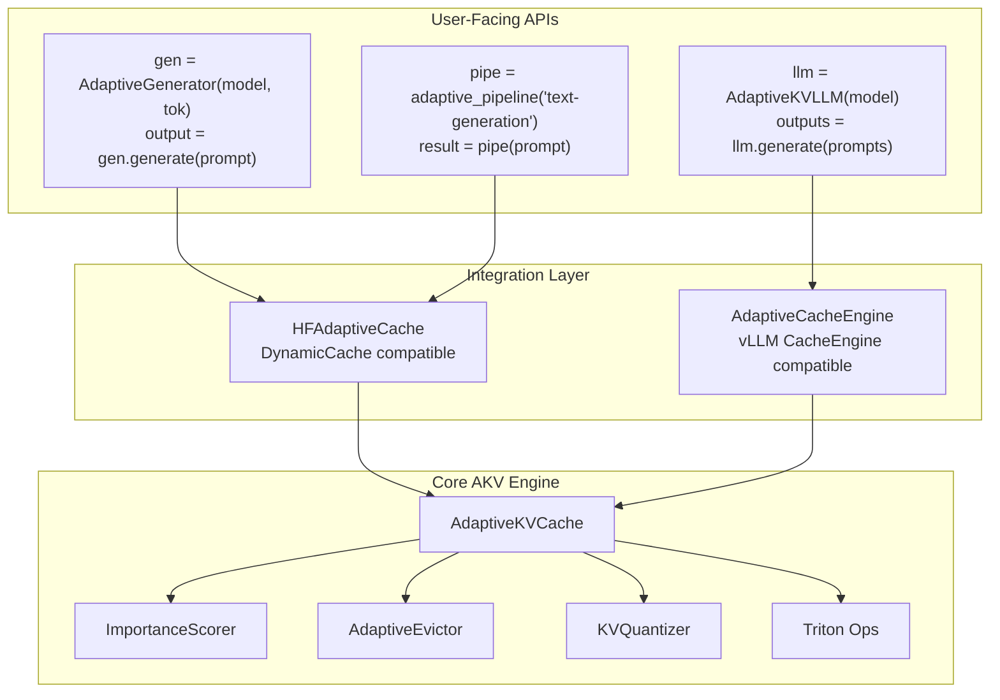

# Architecture Diagrams

## System Architecture (Mermaid)



## Data Flow During Inference



## Memory Layout



## Benchmark Comparison Architecture

```mermaid
graph TB
    subgraph "Evaluation Framework"
        direction TB
        BM[Benchmark Manager]

        subgraph "Methods Under Test"
            FC[Full Cache<br/>No compression]
            H2O[H2O<br/>Heavy-Hitter Oracle]
            KIVI[KIVI<br/>Uniform 2-bit]
            SNP[SnapKV<br/>Observation window]
            SCH[ScissorHands<br/>Persistence filter]
            AKV[AKV (Ours)<br/>Hierarchical adaptive]
        end

        subgraph "Benchmark Suite"
            TP[Throughput<br/>tok/s at scale]
            LT[Latency<br/>TTFT, ITL p50/p99]
            PP[Perplexity<br/>WikiText-2, PG-19]
            NI[Needle-in-Haystack<br/>Delayed recall]
            MN[Multi-Needle<br/>Distributed facts]
            MS[Memory Scaling<br/>VRAM vs seq_len]
        end

        subgraph "Metrics"
            QM[Quality<br/>PPL ratio ≤ 1.02]
            SM[Speed<br/>tok/s, TTFT]
            MM[Memory<br/>VRAM savings %]
            RM[Recall<br/>Accuracy @ depth]
        end
    end

    BM --> FC & H2O & KIVI & SNP & SCH & AKV
    FC & H2O & KIVI & SNP & SCH & AKV --> TP & LT & PP & NI & MN & MS
    TP & LT & PP & NI & MN & MS --> QM & SM & MM & RM
```

## Triton Kernel Fusion Strategy

```mermaid
graph LR
    subgraph "Standard Approach (Wasteful)"
        direction TB
        D1[Dequantize K<br/>N×D int4→fp16] --> A1[Q × K^T<br/>M×N matmul]
        A1 --> S1[Softmax]
        D2[Dequantize V<br/>N×D int4→fp16] --> A2[Attn × V<br/>M×N × N×D]
        S1 --> A2
        style D1 fill:#ff6b6b
        style D2 fill:#ff6b6b
    end

    subgraph "Our Fused Approach"
        direction TB
        F1[Fused Dequant+Dot<br/>Q × dequant(K)^T<br/>On-the-fly per tile] --> F2[Online Softmax<br/>Streaming, no materialization]
        F2 --> F3[Fused Attn×dequant(V)<br/>Tile-by-tile accumulation]
        style F1 fill:#00d2d3
        style F2 fill:#00d2d3
        style F3 fill:#00d2d3
    end
```

## Integration Architecture


